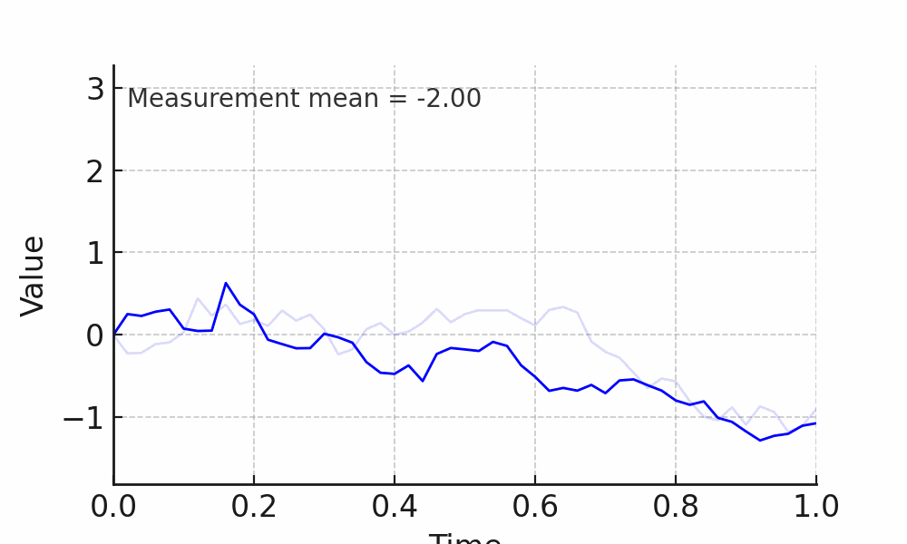

[Home](/) · [Projects](/projects)

# 👋 Welcome

I am a PhD student working on **state estimation** and **system identification** in **stochastic differential equation (SDE)** models.  
This page gathers my projects, theses, and publications.

$$
dX_t = f(t,X_t)dt + \sigma(t,X_t)dW_t
$$

## Publications

<!-- 
### Preprints
- XXX
-->

### Peer-Reviewed

- Hammar, K., Orekhov, A., Wallin Hybelius, P., Wisakanto, A. K., Srivastava, B., Kockum, A. F., & Granath, M. (2022).  
  *Error-rate-agnostic decoding of topological stabilizer codes*. **Physical Review A**, 105, 042616.  
  [DOI: 10.1103/PhysRevA.105.042616](https://doi.org/10.1103/PhysRevA.105.042616) · [arXiv:2112.01977](https://arxiv.org/abs/2112.01977)

- Lange, M., Havström, P., Srivastava, B., Bengtsson, I., Bergentall, V., Hammar, K., Heuts, O., van Nieuwenburg, E., & Granath, M. (2025).  
  *Data-driven decoding of quantum error correcting codes using graph neural networks*. **Physical Review Research**, 7, 023181.  
  [DOI: 10.1103/PhysRevResearch.7.023181](https://doi.org/10.1103/PhysRevResearch.7.023181) · [arXiv:2307.01241](https://arxiv.org/abs/2307.01241)

## Master's Thesis

- [*Fast Bayesian Inference with Piecewise Deterministic Markov Processes*](https://odr.chalmers.se/items/3e5bf326-5657-4b6b-b2dd-0a78b1aa9d03) (2023).  
  Master's thesis, Chalmers University of Technology.  
  Explores Bayesian inference for latent states and parameters in SDE models using PDMP samplers (e.g. Zig-Zag and Bouncy Particle Sampler).

## Supervised master projects

- [*Learning Neural SDEs for Bayesian Filtering and Smoothing*](https://odr.chalmers.se/items/b9eb07df-1bb2-4ade-b522-590c26531e16) by **Gustav Birath Blom** & **Isak Nilsson** (2025).

- [*Diffusion Models for Generative Modelling of a Posteriori Probability Measures in Target Tracking*](https://kth.diva-portal.org/smash/record.jsf?pid=diva2%3A1991123) by **Axel Nilsson** & **David Ahnlund** (2025). KTH, School of Engineering Sciences (Mathematics).

---

_This site is hosted with [GitHub Pages](https://pages.github.com/)._
